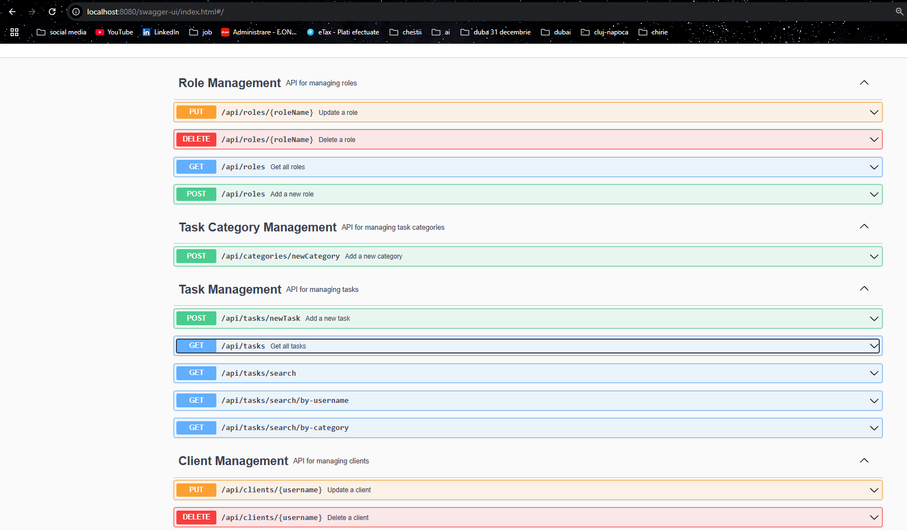

This is a skeleton of Spring Boot application which should be used as a start point to create a working one.
The goal of this task is to create simple REST API  which allows users to manage TODOs. 
The API should allow to create/delete/update TODOs and categories as well as search for user, name, description, deadline and category in any combination. *For example find all todos for an user X where deadline is today and name contains test.* 
The API should also implement basic authorization/authentication: *User X cannot access TODOs of user Y as long as he doesn't have admin role.*

You are free to use any library or testing framework in the project.

Below you may find a proposition of the DB model:


Once you are ready, please send me **link to your git repository** which contains complete solution


# Project Setup Guide

## Initial Setup

When starting the application for the first time, follow these steps:

1. **Data Loader Configuration**:
    - In the `DataLoader` class, you need to **de-comment** the following 3 methods. These methods are responsible for loading initial data into the database.
    - The methods to de-comment are:
        - `loadRoles()`
        - `loadTaskCategories()`
        - `loadUsers()`
        - `loadTasks()`

2. **Database Configuration**:
    - In the `application.properties` (or `application.yml`) file, ensure that the following property is set:
      ```
      spring.jpa.hibernate.ddl-auto=update
      ```
      This will automatically create and update the database schema.

3. **Run the Application**:
    - After de-commenting the methods and setting the property, you can start the application. The database will be created, and the initial data will be loaded into it.

## Accessing the Endpoints

Once the application is running, you can access the **Swagger UI** for exploring the available endpoints:

- Open your browser and visit: [http://localhost:8080/swagger-ui/index.html](http://localhost:8080/swagger-ui/index.html)
  
This will allow you to view and interact with all available REST endpoints.

---

## Additional Notes:
- The initial data loading methods should only be used once (when setting up the project for the first time). After the application is started and the data is loaded, you can comment these methods back.
- Make sure your database connection settings in `application.properties` are configured correctly before starting the application.
